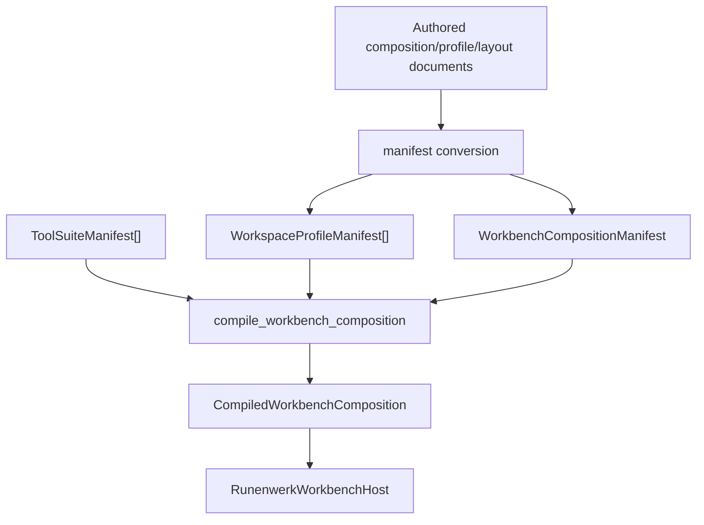
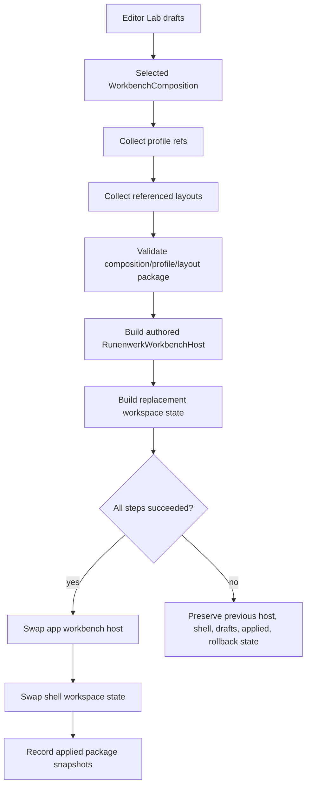

# Editor Tool Suite Registry And Workbench Host Design

## Purpose

Runenwerk needs to make Material Lab-quality tools easy to create without
adding shell-level one-off paths for every future serious tool. The target
architecture is:

```text
Tool Suite Registry + Workbench Host + Provider-Owned Routing
```

A Tool Suite is the reusable contract for a product-grade editor tool family.
It describes stable tool identity, surfaces, providers, routes, product or
preview requirements, commands, validation, and migration metadata without
moving domain semantics into the shell.

A Workbench Host is a runnable app composition that installs one or more suites
and supplies concrete app-owned IO, provider implementations, runtime adapters,
and execution bridges.

ADR 0012 makes this design a clean break for Workbench identity. Legacy
`ToolSurfaceKind` and persisted surface-kind compatibility are not migration
authorities for the Capability Workbench Platform track.

Provider-Owned Routing means the shell hosts routes structurally, but providers
map provider-local interactions into typed command proposals. The shell remains
the workspace host and route carrier. It should not grow a special semantic
branch for every graph, preview, or authoring surface.

"Plugin system" describes only the registration edge. It is not the core
architecture and it does not mean external dynamic plugin loading.

## Current Problem

Adding a serious tool today repeats a tax across several ownership boundaries:

- tool identity;
- layout and profile choices;
- persistence enums;
- surface contracts;
- provider registration;
- graph interaction routing;
- product and preview workflow;
- proof and validation.

`domain/editor/editor_shell/src/workspace/state.rs::ToolSurfaceKind`,
`domain/editor/editor_shell/src/workspace/persisted.rs::PersistedToolSurfaceKindV2`,
`domain/editor/editor_shell/src/workspace/profile.rs::default_workspace_profile_registry`,
`domain/editor/editor_shell/src/workspace/surface_contract.rs::tool_surface_definition_id`,
`apps/runenwerk_editor/src/shell/providers/mod.rs::EditorSurfaceProviderRegistry::runenwerk_default`,
and `domain/editor/editor_shell/src/composition/build_editor_shell.rs::build_frame_widget_routes`
all have to know about current surface families. Graph-canvas actions also have
a provider-owned generic route path through
`domain/editor/editor_shell/src/commands/map_interactions.rs`.

Material Lab is the current proof case, not a bad design. It has the right
product-tool shape: source-backed material graph truth in `domain/material_graph`,
texture product contracts in `domain/texture`, app-owned document IO and
preview orchestration in `apps/runenwerk_editor/src/material_lab`, and concrete
providers under `apps/runenwerk_editor/src/shell/providers/`. The shape is not
yet reusable enough.

## Existing Architecture Fit

This design evolves the existing editor surface seam. It does not replace it.

ADR 0006 already accepts provider seams, `ToolSurfaceInstanceId`,
deterministic provider resolution, fail-closed provider behavior, and explicit
app-owned registry composition. `domain/editor/editor_shell/src/surface_provider.rs`
already carries app-neutral provider request, artifact, route, and frame DTOs.
`apps/runenwerk_editor/src/shell/providers/mod.rs` already owns concrete
provider registration and deterministic resolution.

ADR 0001 keeps mutations domain-owned. Tool suites may describe command
contracts and route families, but material, texture, procgen, animation,
gameplay, physics, and scene mutations must still be owned by their domains or
app-owned bridges.

ADR 0004 separates editable descriptions from runtime and execution objects.
Suites describe available surfaces and pipelines; runtime adapters and render
execution remain concrete app or engine concerns.

ADR 0005 makes projections derived state. `EditorShellFrameModel.surfaces`,
graph canvas view models, product previews, and provider route tables remain
resolved artifacts, not source truth.

ADR 0010 keeps the graph substrate structural and semantic-free.
`domain/ui/ui_graph_editor/src/lib.rs::GraphCanvasAction` and related view
models must not gain material, procgen, gameplay, animation, or physics meaning.
Provider-owned mapping is the route from structural canvas actions into owning
domain command proposals.

## Decision

Runenwerk should introduce a typed Tool Suite Registry and Workbench Host
composition model.

A tool suite may contribute:

- stable tool-suite id;
- stable surface keys;
- typed suite, surface, profile, and provider handles;
- surface definitions;
- provider family definitions;
- workspace/profile contributions;
- command descriptors;
- route descriptors;
- optional graph-canvas route contract;
- optional product/preview pipeline descriptors;
- validation/proof requirements;
- migration/deprecation metadata.

A tool suite must not own:

- source semantics belonging to a domain crate;
- app project IO;
- renderer internals;
- runtime execution authority;
- persistence authority outside stable key descriptors;
- global mutable registries.

Old workspace layouts that require legacy surface-kind fields are unsupported
under this design. They should fail with a clear unsupported-schema diagnostic
instead of being migrated through compatibility metadata.

Canonical PlantUML source for startup and provider resolution:
[diagrams/editor-tool-suite-registration-flow.puml](diagrams/editor-tool-suite-registration-flow.puml).

## Workbench Composition Compiler

Workbench composition is now declared through three separate manifests in
`domain/editor/editor_shell/src/workbench/`:

- `ToolSuiteManifest` for suite-owned surfaces, provider families, routes, and
  capabilities.
- `WorkspaceProfileManifest` for durable `ProfileRef` identity, compatibility
  `WorkspaceProfileId`, default surfaces, modes, filters, and layout source.
- `WorkbenchCompositionManifest` for the runnable workbench id, installed
  suite ids, included profile refs, default profile ref, and host capability
  policy.

The app-neutral compiler accepts built-in manifests and authored
editor-definition documents through the same validation path:



`ProfileRef` is the durable profile authority. `WorkspaceProfileId` remains a
runtime compatibility handle for older profile-first call sites until a later
cleanup removes them. Legacy `ToolSurfaceKind` may appear only in compatibility
metadata; provider validation and authored layouts use stable surface keys,
provider-family ids, routes, and capabilities as authority.

## Authored Package Activation

Editor Lab custom workbenches are package operations, not single-document
activation. A selected `WorkbenchComposition` document gathers its referenced
profile documents and their referenced layout documents, then queues one atomic
`WorkbenchCompositionPackage` payload.



Apply review and rollback are package-aware for workbench compositions: the
composition, profiles, and layouts enter applied, last-applied, and rollback
state together. Runtime activation preserves the previous host and shell state
when manifest conversion, compiler validation, provider support validation, or
replacement workspace formation fails.

## Ownership Rules

Canonical PlantUML source for ownership boundaries:
[diagrams/editor-tool-suite-ownership.puml](diagrams/editor-tool-suite-ownership.puml).

`domain/editor/editor_shell` owns:

- app-neutral tool-suite contracts;
- surface definitions;
- provider-family contracts;
- provider-owned route vocabulary;
- workspace host contracts;
- registry validation vocabulary;
- fail-closed provider-resolution artifacts.

`domain/editor/editor_definition` owns:

- authored editor definitions;
- authored panel/tool-surface registries;
- future authored references to available tool suites;
- validation of authored definition documents.

`apps/runenwerk_editor` and future apps own:

- concrete workbench composition;
- installed suite list;
- concrete provider implementations;
- app-owned provider registry construction;
- project IO;
- persistence paths;
- runtime/render adapters;
- preview orchestration;
- app-owned command execution bridge.

Owning domains such as `domain/material_graph`, `domain/texture`,
`domain/procgen`, and future `domain/animation` own:

- source truth;
- domain commands;
- ratification;
- semantic IR;
- product descriptors where applicable;
- diagnostics.

`engine/render` owns:

- generic render-flow execution;
- product consumption;
- capture/readback/diff infrastructure;
- no editor, tool, material, texture, procgen, animation, gameplay, or other
  domain semantic ownership.

`domain/ui/ui_graph_editor` owns:

- graph canvas interaction substrate;
- pan, zoom, selection, edge drag, and view model DTOs;
- no material, procgen, gameplay, animation, physics, particle, or gameplay
  semantics.

## Conceptual API Shape

The following Rust-like pseudocode is conceptual. It names the target
responsibilities and intended ownership. It is not mandatory final syntax.

`editor_shell` owns generic tool-suite contract vocabulary only.

```rust
// domain/editor/editor_shell/src/tool_suite/mod.rs
// Types: EditorToolSuite, ToolSurfaceDefinition, ToolSurfaceRegistry,
//        ProviderFamilyDefinition

pub struct EditorToolSuite {
    pub id: ToolSuiteId,
    pub surfaces: Vec<ToolSurfaceDefinition>,
    pub provider_families: Vec<ProviderFamilyDefinition>,
    pub acceptance: ToolAcceptanceContract,
}

pub struct ToolSurfaceDefinition {
    pub key: ToolSurfaceStableKey,
    pub label: String,
    pub role: ToolSurfaceRole,
    pub provider_family: ProviderFamilyId,
    pub route: ToolSurfaceRoute,
    pub persistence: ToolSurfacePersistence,
}

pub enum ToolSurfaceRoute {
    StaticAction,
    ProviderOwnedGraphCanvas,
    ProviderOwnedLocal,
}

pub enum ToolSurfacePersistence {
    StableKey,
}
```

`editor_shell` may own:

- `EditorToolSuite`;
- `ToolSurfaceDefinition`;
- `ToolSurfaceRegistry`;
- `ProviderFamilyDefinition`;
- `ToolSurfaceRoute`;
- `ToolSurfacePersistence`;
- `ToolAcceptanceContract`;
- provider-owned route vocabulary;
- fail-closed registry and provider-resolution vocabulary.

`editor_shell` must not import:

- `domain/material_graph`;
- `domain/texture`;
- `MaterialGraphCommandContract`;
- `MaterialPreviewPipeline`;
- app provider types;
- render-preview adapter types.

Concrete suite factories are contributed by app composition or future
tool-support crates. Near term, Material Lab suite declaration belongs with the
app-owned Material Lab workflow because current Material Lab provider,
product-preview, project IO, and runtime/render wiring live in
`apps/runenwerk_editor`.

```rust
// apps/runenwerk_editor/src/material_lab/tool_suite.rs
// Function: material_lab_tool_suite

pub fn material_lab_tool_suite() -> EditorToolSuite {
    EditorToolSuite::new("runenwerk.material_lab")
        .label("Material Lab")
        .owns_domain("domain/material_graph")
        .documents([
            DocumentKind::MaterialGraph,
            DocumentKind::Material,
        ])
        .surface(
            ToolSurfaceDefinition::new("material.graph_canvas", "Material Graph")
                .role(ToolSurfaceRole::Primary)
                .provider_family("material_lab")
                .capabilities([
                    SurfaceCapability::GraphCanvas,
                    SurfaceCapability::Diagnostics,
                ])
                .route(ToolSurfaceRoute::ProviderOwnedGraphCanvas)
                .persistence(ToolSurfacePersistence::StableKey),
        )
        .surface(
            ToolSurfaceDefinition::new("material.inspector", "Material Inspector")
                .role(ToolSurfaceRole::Inspector)
                .provider_family("material_lab")
                .persistence(ToolSurfacePersistence::StableKey),
        )
        .surface(
            ToolSurfaceDefinition::new("material.preview", "Material Preview")
                .role(ToolSurfaceRole::Preview)
                .provider_family("material_lab")
                .product_pipeline("material.preview_product")
                .failure_policy(ProductFailurePolicy::PreserveLastValidWithDiagnostic)
                .persistence(ToolSurfacePersistence::StableKey),
        )
        .commands(material_graph_command_descriptors())
        .product_pipeline(material_preview_pipeline_descriptor())
        .acceptance(ToolAcceptanceContract::perfectionist_verified())
}
```

A future dedicated material tool-support crate may own this suite factory only
after provider DTOs, preview/product descriptors, and project/runtime adapters
are separated from `apps/runenwerk_editor`. Standalone material editor support
must come from `WorkbenchHost` composition, not by depending on
`apps/runenwerk_editor` internals.

Owning semantic domains still own source truth, domain commands, ratification,
semantic IR, product descriptors, and diagnostics. Apps own concrete workbench
installation, provider implementation, project IO, persistence paths,
runtime/render adapters, preview orchestration, and the app-owned command
execution bridge.

Provider mapping should move provider-local route interpretation to provider
contracts instead of making `editor_shell` own every graph-tool semantic branch.

```rust
// domain/editor/editor_shell/src/surface_provider.rs
// Method: ToolSurfaceProvider::map_interaction

pub trait ToolSurfaceProvider {
    fn descriptor(&self) -> SurfaceProviderDescriptor;

    fn supports(
        &self,
        request: &SurfaceProviderRequest,
        registry: &ToolSurfaceRegistry,
    ) -> SurfaceProviderAvailability;

    fn build_frame(
        &self,
        context: &SurfaceProviderBuildContext,
    ) -> ResolvedSurfaceFrame;

    fn map_interaction(
        &self,
        route: &SurfaceLocalRoute,
        interaction: SurfaceInteraction,
    ) -> Option<ShellCommand>;
}
```

The final contract may return `SurfaceCommandProposal` rather than
`ShellCommand`, split build and dispatch contexts, or use an app-side provider
trait. The architectural point is that the shell carries route context and
providers map local interactions into typed proposals.

## Provider-Owned Graph Routing

Shell-level `MaterialGraphCanvas` routing should not be copied for Procgen,
Gameplay, Animation, Particles, Physics, SDF, or future graph tools.

The target direction:

- `SurfaceLocalRoute` should carry enough provider/tool context.
- `GraphCanvasAction` remains semantic-free.
- Each provider maps `GraphCanvasAction` into its own domain command proposal.
- Shell should not know "Material Graph Canvas" as a special routing branch.
- Guard tests should prevent future shell-level graph-tool route branches.

This keeps `domain/editor/editor_shell/src/commands/map_interactions.rs` a
structural route-to-provider bridge instead of a catalog of tool semantics.

Canonical PlantUML source for this routing path:
[diagrams/provider-owned-graph-routing.puml](diagrams/provider-owned-graph-routing.puml).

## Stable Surface Keys And Persistence

Tool surfaces should persist stable surface keys, not ever-growing versioned
enum variants per tool. Existing enum-backed layouts are compatibility state,
not the long-term extensibility contract.

Compatibility adapters may be needed for current `ToolSurfaceKind`,
`PanelKind`, `PersistedPanelKindV2`, and `PersistedToolSurfaceKindV2` values.
Those adapters should map known legacy variants to stable keys. They should not
make registry activation rewrite existing workspace state.

Unknown stable keys must fail closed with diagnostics. Removed or incompatible
keys must not silently mutate workspace layout. Registry activation alone must
not rewrite existing workspace state; an explicit workspace layout command,
definition activation, migration, or user action should be required.

Canonical PlantUML source for persistence behavior:
[diagrams/stable-tool-surface-key-persistence.puml](diagrams/stable-tool-surface-key-persistence.puml).

## Workbench Host Model

A Workbench Host composes installed suites, app-owned provider registries,
project IO, runtime adapters, render preview adapters, and command execution
bridges.

Full editor:

- installs only provider-backed scene, material, texture, procgen, asset,
  diagnostics, editor-design, viewport, and product suites. Future metadata-only
  suites stay outside runnable compositions until provider support exists.

Standalone material editor:

- installs material, texture, product-preview, diagnostics, and minimal project
  IO suites.

Standalone UI editor:

- installs UI layout, theme, menu, shortcut, command-binding, shell preview,
  and validation suites.

The long-term composition path is a manifest compiler, not a fluent builder.
Apps declare data; `domain/editor/editor_shell/src/workbench/compiler.rs` turns
that data into validated registries:

```text
ToolSuiteManifest[]
WorkspaceProfileManifest[]
WorkbenchCompositionManifest
Authored workspace/profile documents
        |
        v
compile_workbench_composition(...)
        |
        v
CompiledWorkbenchComposition
        |
        v
RunenwerkWorkbenchHost
```

`ProfileRef` is the durable profile identity. `WorkspaceProfileId` remains a
compiled/runtime compatibility handle for existing call sites. Built-in
profiles and authored workspace/profile documents must pass through the same
compiler validation path before the app host can expose them.

Standalone apps must not depend on `apps/runenwerk_editor` internals. Shared
app-neutral contracts belong in `domain/editor/editor_shell` or dedicated
reusable app-support crates. Concrete app composition remains in `apps/*`.

Current implementation note: `apps/runenwerk_editor/src/shell/compositions/`
owns the built-in Runenwerk composition/profile manifests. `RunenwerkWorkbenchHost`
selects one composition, collects installed suite manifests and profile
manifests, calls `compile_workbench_composition`, and then validates app-owned
provider support. The Material Lab and UI Designer standalone binaries start
named compositions through this same path.

Canonical PlantUML source for workbench compositions:
[diagrams/workbench-host-compositions.puml](diagrams/workbench-host-compositions.puml).

## External Inspiration

VS Code contribution points are useful for separating declarations from
handlers. Runenwerk should borrow that manifest/contribution split, but reject
JavaScript extension-host dynamics as the first step.

IntelliJ `plugin.xml` and extension points are useful for stable ids and
explicit dependencies. Runenwerk should borrow those ideas, not the full IDE
plugin lifecycle complexity early.

Kubernetes CRD/controller architecture is useful for declaration,
reconciliation, and status diagnostics. Runenwerk should not make the registry
application-data truth.

Terraform provider schemas are useful for schema validation, versioning,
deprecation, and acceptance testing. Runenwerk should not let providers own
global mutable state.

Godot editor plugins are useful for dock and tool contribution ergonomics.
Runenwerk should reject imperative arbitrary editor mutation.

The WebAssembly Component Model may be a later external plugin boundary. That
decision is explicitly deferred.

## Alternatives Considered And Rejected

### 1. Keep Adding Enum Variants And Match Arms

Rejected because it preserves the repeated tax and creates Material Lab-shaped
one-offs for every serious future tool.

### 2. Dynamic External Plugin Marketplace Now

Rejected because ABI, sandboxing, permissions, security, migration, package
trust, unload/reload, and compatibility are premature.

### 3. One Universal EditorTool God Trait

Rejected because it centralizes semantic ownership and blurs source truth,
surface hosting, app IO, product formation, and runtime execution.

### 4. Move All Tool Behavior Into editor_shell

Rejected because `editor_shell` should own host contracts, not material,
texture, procgen, animation, gameplay, or other tool semantics.

### 5. Fork Standalone Material Editor From runenwerk_editor

Rejected because standalone apps should be different `WorkbenchHost`
compositions, not app forks.

### 6. Build A Scaffolder First

Rejected as a first step. A scaffolder is acceptable later after the registry
contract is stable.

## Migration Plan

### Phase 0: Design And ADR

- land this active design;
- land proposed ADR;
- validate docs.

### Phase 1: Tool Suite Registry Contract Foundation

- add `editor_shell` tool-suite module;
- define `ToolSuiteId`, `ToolSurfaceStableKey`, `ProviderFamilyId`,
  `ProviderFamilyDefinition`, `ToolSurfaceDefinition`, and
  `ToolSuiteRegistry`;
- add validation for duplicate suite ids, duplicate stable surface keys,
  duplicate provider-family ids, invalid provider-family references, unknown
  stable keys, and stable iteration order;
- add Material Lab legacy stable-key candidates without changing live workspace
  identity, V4 persistence, provider request shape, provider routing, or
  default workspace profiles;
- declare the Material Lab suite without wiring it into the live provider
  registry.

### Phase 2: Registry-Backed Workspace Compatibility

Status: completed as a compatibility layer.

- add stable keys alongside `ToolSurfaceKind`;
- keep enum compatibility;
- derive metadata from `ToolSurfaceRegistry` where available;
- do not bump the persistence format yet.

Phase 2 completed registry-aware compatibility helpers for workspace mounted
surface metadata, surface contract adapters, authored layout resolution, and
default profile compatibility reports. It intentionally did not migrate live
tool-surface identity, panel identity, V4 persistence, provider request shape,
provider routing, WorkbenchHost composition, or graph routing. Phase 3 may begin
V5 persistence planning only after the Phase 2 closeout review passes.

### Phase 3A: PersistedWorkspaceStateV5 Conversion

Status: explicit conversion path is present; default writer activation remains
pending.

- write stable keys;
- read V1-V4 through legacy adapters;
- fail closed for unknown or incompatible keys.

Phase 3A added V5 persisted DTOs and explicit workspace conversion methods
that write stable tool-surface keys as primary persisted identity while keeping
live `ToolSurfaceKind` and `PanelKind` authority unchanged. The default
workspace layout writer remains on V4 until a separate Phase 3B activation
switch is reviewed and covered.

### Phase 3B: Default V5 Writer Activation

Status: default app writer targets V5; V1-V4 load compatibility remains.

- switch the app workspace layout writer from V4 to V5;
- keep V1-V4 reads supported;
- keep provider requests, graph routing, and WorkbenchHost composition out of
  the persistence switch.

New V5 saves use `stable_surface_key` as the primary persisted tool-surface
identity and keep legacy tool-surface kinds only as compatibility metadata.
Live workspace state remains enum-backed until a later migration phase.
The temporary reverse bridge is limited to current saveable editor surfaces
with explicit suite ownership; surfaces without a safe namespace still fail V5
save instead of receiving speculative keys.

### Phase 4: Provider Request Metadata And Provider-Family Map Compatibility

Status: compatibility metadata path is present; provider selection remains
enum-backed.

- add advisory stable-key, provider-family, and route metadata to
  `SurfaceProviderRequest`;
- add `ProviderFamilyProviderMap` validation for app-owned provider-family
  assignments;
- keep existing enum-backed provider `supports` behavior as the live selection
  path;
- do not switch to stable-key-only provider routing, provider-owned graph
  routing, or WorkbenchHost composition in this phase.

### Phase 5: Material Lab Provider-Owned Graph Routing

Status: Material Lab provider-owned graph routing implemented.

- route graph canvas actions as generic provider-owned surface interactions;
- keep `GraphCanvasAction` semantic-free in `ui_graph_editor`;
- move Material Graph canvas semantic mapping into
  `MaterialGraphCanvasProvider`;
- keep WorkbenchHost composition and broad provider-family filtering as future
  work.

### Phase 6: WorkbenchHost Composition

Status: Workbench composition compiler introduced.

- build the compiled suite, profile, and provider-family registries through
  `domain/editor/editor_shell/src/workbench/compiler.rs`;
- keep profile identity `ProfileRef`-authoritative while preserving
  `WorkspaceProfileId` compatibility lookups;
- keep cross-suite built-in profiles in
  `apps/runenwerk_editor/src/shell/compositions/`;
- validate that every installed provider family has assigned app providers and
  that assigned providers support compiled stable surface keys;
- keep dynamic plugins and external workbench packaging deferred.

Post-migration extension: `RunenwerkWorkbenchHost` exposes Full Editor,
Material Lab, UI Designer, Headless Validation, Constrained, and test/custom
composition paths through the compiler. Metadata-only future suites no longer
enter runnable workbenches without concrete provider support.

### Phase 7: Suite Ownership and Stable-Key Coverage

Status: current saveable surface coverage implemented.

- expand compiled-in suite metadata beyond Material Lab to cover current
  saveable editor surfaces with explicit namespaces;
- keep `Placeholder` covered by an explicit diagnostics/fallback namespace so
  V5 can preserve current tool-workspace layout structure;
- keep live workspace and profile authority enum-backed through
  `ToolSurfaceKind` and `PanelKind`;
- keep provider supports enum-backed and leave provider-family filtering as
  future work;
- keep dynamic plugins deferred.

### Phase 8: Registry-Backed Workspace/Profile Construction

Status: registry-aware workspace/profile construction implemented with enum
authority retained.

- add strict registry-backed default profile builders that validate registered
  stable-key coverage before producing a `WorkspaceState`;
- use `RunenwerkWorkbenchHost` registry metadata for app default workspace
  construction and default workspace fallback paths where the host is
  available;
- add registry-aware authored workspace definition formation so stable authored
  keys fail closed when unknown and populate advisory stable-key metadata when
  registered;
- keep `ToolSurfaceKind` and `PanelKind` as live workspace/profile authority;
- keep stable keys as advisory live metadata plus V5 persisted identity, not
  the sole live identity;
- keep future-looking suite namespaces as metadata coverage for current
  saveable surfaces, not as claims that those product domains are implemented;
- keep provider-family filtering, stable-key-only provider supports, and
  dynamic plugins deferred.

### Phase 8 Closeout and Phase 9 Decision

Status: Phase 8 closeout passed; Phase 9 should start with provider-family
filtering activation.

- keep the Phase 8 construction boundary: app default workspace construction,
  fallback default workspace construction, and registry-aware authored layout
  formation may consult `ToolSurfaceRegistry`, but live workspace identity
  remains enum-backed;
- keep saved-layout loading on the Phase 3 V5/V1-V4 persistence path; do not
  alter the persistence format for the Phase 9 provider-routing decision;
- Option A, provider-family filtering activation, is the next safe step because
  `SurfaceProviderRequest` already carries advisory provider-family metadata
  and `ProviderFamilyProviderMap` already validates family/provider
  assignments;
- Option B, stable-key-first provider matching, should wait until
  provider-family filtering is proven against current enum-backed provider
  behavior;
- Option C, live `WorkspaceState` stable-key authority migration, should wait
  until provider matching and registry-backed provider resolution are stable;
- future-looking placeholder suite namespaces remain metadata coverage for
  saveable surfaces only, not implemented gameplay, particle, physics,
  animation, or simulation domains.

### Phase 9B: Provider-Family Filtering Activation

Status: provider-family filtering activation implemented with enum-backed
provider supports retained.

- `RunenwerkWorkbenchHost` owns the compiled-in
  `ProviderFamilyProviderMap` alongside the suite and provider registries;
- live mounted-surface requests are enriched from the hosted
  `ToolSurfaceRegistry` before provider resolution;
- when a request carries `provider_family_id`, provider resolution first
  narrows candidates to the family-assigned provider ids, then runs the
  existing deterministic `supports` and priority/ambiguity checks;
- requests without provider-family metadata keep the legacy full-provider
  candidate path;
- missing provider-family assignments fail closed with diagnostic frames and
  zero provider-local routes;
- provider `supports` implementations remain enum-backed, stable-key-first
  provider matching remains future work, and live `WorkspaceState` authority
  remains `ToolSurfaceKind` plus `PanelKind`;
- future-looking placeholder suite families remain metadata-only and do not
  claim providers for unimplemented gameplay, particle, physics, animation, or
  simulation domains;
- dynamic plugins remain deferred.

### Phase 9B Closeout and Option B Decision

Status: Phase 9B closeout passed; Option B may start as the next provider
matching slice.

- keep provider-family filtering as the active ownership narrowing seam;
- keep provider `supports` implementations enum-backed until Option B adds
  stable-key-first matching explicitly;
- keep requests without provider-family metadata on the legacy full-provider
  scan path;
- keep future placeholder suite families unassigned unless their current
  provider ownership is explicit;
- Option B, stable-key-first `SurfaceProviderRequest` matching, is the next
  safe step if it preserves the existing provider-family filtering behavior;
- Option C, live `WorkspaceState` stable-key authority migration, remains
  blocked until stable-key-first provider matching is implemented and proven.

### Phase 10: Stable-Key-First Provider Matching

Status: stable-key-first provider matching implemented with enum-backed
fallback retained.

- provider resolution keeps Phase 9B provider-family candidate narrowing as the
  first ownership filter;
- providers can report `StableKey`, `LegacyKind`, or `Unsupported` support
  modes;
- stable-key support is preferred over legacy support before applying the
  existing provider priority and ambiguity rules;
- legacy `ToolSurfaceKind` fallback remains available for migration safety and
  registry-free request paths;
- stable-key ambiguity remains fail-closed and does not silently fall back to
  legacy providers;
- live workspace and panel authority remain `ToolSurfaceKind` and `PanelKind`;
- V5 persistence format, graph routing, WorkbenchHost composition, and dynamic
  plugin policy are unchanged;
- future placeholder suite families remain metadata-only and unimplemented
  domains are not claimed by stable-key provider support.

### Option C1: ToolSurfaceState Stable-Key Authority

Status: C1 implemented as a staged hardcut at the `ToolSurfaceState` ownership
point only.

- `ToolSurfaceState` now treats `ToolSurfaceStableKey` as the required
  authoritative tool-surface identity;
- legacy `ToolSurfaceKind` is retained on `ToolSurfaceState` only as optional
  compatibility metadata for consumers that have not moved in C2-C5;
- legacy construction paths use explicit compatibility wrappers that convert
  `ToolSurfaceKind` through the stable-key registry mapping instead of silently
  inventing keys;
- V5 persisted layouts continue to write the same stable-key primary format,
  and V1-V4 reads bridge through the legacy adapters into stable-key
  authoritative state;
- `PanelKind` remains unchanged and authoritative for panel grouping in C1;
- reducers, profile storage, projection/provider request authority, provider
  matching, graph routing, and the V5 wire format were intentionally not
  migrated in this slice.

C1 closeout: passed. Remaining `ToolSurfaceKind` usage is constrained to
legacy compatibility wrappers, V1-V4 migration/legacy persistence boundaries,
profile storage pending C3, projection and provider request compatibility
pending C4, and tests. The legacy V1-V4 write
helpers remain compatibility-only and should be quarantined with the rest of
the enum boundary work in C5.

### Option C2: Reducer And Mutation Stable-Key Authority

Status: C2 implemented for workspace reducer and mutation authority only.

- normal reducer surface mutations now carry `ToolSurfaceStableKey` as the
  authoritative surface identity;
- `ToolSurfaceKind` entry points are retained as explicitly named legacy
  wrapper constructors that convert through the stable-key compatibility map;
- tab-stack area locks use stable keys as the in-memory lock authority while
  retaining optional legacy lock metadata for projection and persistence
  compatibility;
- reducer behavior for add tab, split, duplicate, reset, close, replace, lock,
  tab order, active panel, and structural identity remains covered by parity
  tests;
- `PanelKind` remains authoritative for panel grouping in C2.

C3-C6 remain pending. Profile default storage moves in C3,
projection/provider request authority remains compatibility-backed until C4,
enum use should be quarantined at boundaries in C5, and the final
`ToolSurfaceKind`/`PanelKind` decision remains C6 work.

C2 closeout: passed. Projection changes remain compatibility-only: projected
tab-stack lock metadata still exposes the legacy tool-surface kind for current
shell commands, while reducer lock authority is the stable key. Persistence
changes remain boundary-only: V1-V5 wire shapes are unchanged, and legacy lock
fields are bridged to and from stable-key-authoritative in-memory state. C3
profile/default storage, C4 projection/provider request authority, C5 enum
boundary quarantine, and C6 final enum decisions remain pending.

### Option C3: Profile Default Storage Stable-Key Authority

Status: C3 implemented for workspace profile/default surface storage only.

- `WorkspaceProfile` default surfaces now store `ToolSurfaceStableKey` as the
  primary profile/default surface identity;
- legacy `ToolSurfaceKind` is retained on profile default surface records only
  as optional compatibility metadata for panel grouping and C4 projection
  compatibility;
- default profile construction stores stable-key profile data while retaining
  explicitly named legacy profile constructors for compatibility fixtures;
- default profile order, layout shape, profile ids, labels, modes, and document
  filters remain unchanged;
- tool-workspace bootstrap has a stable-key input path that creates
  `ToolSurfaceState` through stable-key authority while retaining a named
  legacy enum wrapper;
- `PanelKind` remains authoritative for panel grouping in C3.

C4-C6 remain pending. Projection/provider request authority has not moved,
`SurfaceProviderRequest` and provider matching are unchanged, V5 persistence
format is unchanged, graph routing is unchanged, dynamic plugins remain
deferred, enum quarantine remains C5 work, and final
`ToolSurfaceKind`/`PanelKind` decisions remain C6 work.

C3 closeout: passed. Profile storage no longer uses `Vec<ToolSurfaceKind>` as
the authoritative default surface list. Remaining `ToolSurfaceKind` uses in
profile/default construction are constrained to legacy constructors,
compatibility metadata, compiled-in profile fixtures, and tests. Projection and
provider request authority remain unchanged for C4. The registry-free default
workspace builder still contains a compiled-in compatibility `expect` and
should remain visible until C5 boundary quarantine.

### Option C4: Projection And Provider Request Stable-Key Authority

Status: C4 implemented for the workspace projection to provider-request handoff
only.

- projected active panels now expose the active `ToolSurfaceStableKey` as the
  normal projected surface identity and retain legacy `ToolSurfaceKind` only as
  optional compatibility metadata;
- projected tab-stack locks expose `locked_stable_surface_key` as the lock
  authority and keep `legacy_locked_tool_surface_kind` only for the shell
  commands that are still explicitly pending later migration;
- `SurfaceProviderRequest` now requires `stable_surface_key:
  ToolSurfaceStableKey`;
- `SurfaceProviderRequest` keeps `legacy_tool_surface_kind:
  Option<ToolSurfaceKind>` only as compatibility metadata for provider fallback
  and not as request authority;
- live mounted-surface request construction reads stable keys from
  `ToolSurfaceState` and enriches provider family/route metadata from the
  hosted `ToolSurfaceRegistry`;
- provider matching remains the Phase 10 stable-key-first path with legacy
  fallback and active provider-family filtering;
- V5 persistence format, graph routing, WorkbenchHost composition, provider
  ownership, and dynamic plugin policy are unchanged.

C5-C6 remain pending. Enum boundary quarantine has not started, and
`ToolSurfaceKind`/`PanelKind` final decisions are still deferred. `PanelKind`
remains authoritative for panel grouping.

C4 closeout: passed. Normal projection and provider request construction now
use `ToolSurfaceStableKey` as authority and keep `ToolSurfaceKind` only as
optional compatibility metadata. Live request enrichment fails closed when
registry metadata is unavailable, providers tolerate absent legacy metadata,
and provider-family filtering plus stable-key-first matching remain unchanged.
C5 should quarantine remaining enum use to explicit compatibility boundaries;
C6 should decide the final `ToolSurfaceKind` and `PanelKind` policy only after
that quarantine passes.

### Option C5: ToolSurfaceKind Boundary Quarantine

Status: C5 implemented as a compatibility-boundary quarantine, not deletion.

- `ToolSurfaceKind` remains available only for explicit legacy and migration
  boundaries: V1-V4 persisted layout migration, V5 legacy metadata validation,
  authored legacy-key adapters, named legacy wrappers, shell UI command
  compatibility pending C6, temporary reverse bridge functions, and
  compatibility tests;
- normal `ToolSurfaceState`, `WorkspaceMutation`, `WorkspaceProfile`,
  projection, provider request construction, V5 persisted identity, and
  provider matching remain stable-key primary;
- runtime viewport/session classifiers that already have stable keys use
  stable-key checks instead of recovering enum authority;
- source guards cover the normal state, reducer, profile, provider request, and
  shell UI compatibility seams so new enum authority cannot quietly re-enter;
- `PanelKind` remains the live panel grouping authority.

C5 closeout: passed. Remaining `ToolSurfaceKind` uses are either stable-key
replacement points, explicitly named legacy compatibility seams, migration
boundaries, shell UI/app command compatibility pending C6, compiled-in suite
metadata, or tests. No C6 enum or panel decision has started.

C6 remains pending. C5 intentionally does not remove `ToolSurfaceKind`, remove
`PanelKind`, change V5 persistence, change graph routing, change provider
matching, or decide whether `PanelKind` should remain structural UI grouping
or become registry-derived metadata.

### Option C6A: PanelKind Role Decision

Status: C6A implemented. `PanelKind` is retained as structural shell/layout
grouping.

- `ToolSurfaceStableKey` remains the authoritative tool-surface identity;
- `PanelKind` describes panel chrome, layout grouping, and shell affordances,
  not provider or tool semantics;
- `PanelKind` must not replace stable-key identity or be used as provider
  matching authority;
- C6B-C6D remain pending for the final `ToolSurfaceKind` legacy-boundary
  placement, any remaining normal-path enum cleanup, and end-to-end authority
  guards.

### Option C6B: ToolSurfaceKind Legacy Boundary Labeling

Status: C6B implemented as labeling and guard hardening, not deletion.

- `ToolSurfaceKind` remains publicly available for existing compatibility
  callers, but its declaration now documents it as a legacy boundary enum;
- `ToolSurfaceStableKey` remains the normal tool-surface identity for state,
  reducers, profile defaults, projection, provider requests, provider-family
  filtering, and provider matching;
- helper APIs that still accept or recover `ToolSurfaceKind` are either
  legacy-named, live under `tool_suite::legacy`, or documented as C6B legacy
  boundary helpers;
- C6C-C6D remain pending for a normal-path enum usage sweep and final
  stable-key authority guards.

### Option C6C: Normal-Path Enum Usage Sweep

Status: C6C implemented as a targeted sweep, not deletion.

- remaining app command compatibility lookup now resolves `ToolSurfaceKind`
  from `ToolSurfaceStableKey` first, then falls back to legacy metadata only
  at the named `LegacySurfaceCommandContract` boundary;
- viewport and surface-session classifiers use stable-key checks when stable
  keys are already available;
- shell menu/chrome enum usage remains explicitly marked as compatibility
  pending final cleanup, and normal workspace, reducer, profile, projection,
  provider request, provider-family filtering, and provider matching paths stay
  stable-key primary;
- `PanelKind` remains structural shell/layout grouping;
- C6D remains pending for final end-to-end guards and closeout.

### Option C6D: Final Stable-Key Authority Closeout

Status: C6D implemented. Option C is complete.

- C1-C4 moved normal tool-surface authority end to end to
  `ToolSurfaceStableKey`: state, reducers/mutations, profile defaults,
  projection, provider requests, provider-family filtering, and provider
  matching;
- C5-C6 quarantined and labeled `ToolSurfaceKind` as a legacy compatibility
  boundary enum for V1-V4 migration, V5 legacy metadata validation, authored
  legacy adapters, named legacy wrappers, shell/app command compatibility,
  temporary reverse bridges, and compatibility tests;
- `PanelKind` remains a live structural shell/layout grouping concept and must
  not be treated as tool-surface identity;
- V5 persistence format remains unchanged and continues to write
  `stable_surface_key` as primary persisted identity;
- Material Graph graph routing remains provider-owned, WorkbenchHost remains
  compiled-in composition, and dynamic external plugins remain deferred;
- future work may convert shell UI menus/chrome and app command compatibility
  seams to stable-key-native APIs, but those seams are explicitly marked and no
  longer act as normal authority.

Baseline repair after C6D tightened the completed state without changing the
deferred product scope:

- V5 tab-stack locks now persist `locked_stable_surface_key` as the primary
  lock identity and keep legacy locked `ToolSurfaceKind` only as compatibility
  metadata;
- V1-V4 locked-kind layouts still migrate through the legacy bridge into
  stable-key lock authority;
- app V5 layout loading now passes the WorkbenchHost `ToolSurfaceRegistry` so
  stable-key-only persisted surfaces and tab-stack locks load through the real
  app read path;
- shell tab-stack split/reset/lock chrome now emits stable-key commands for
  active stable-key surfaces, so stable-key-only tools such as the Tool Suite
  Registry Inspector are not silently remapped to viewport semantics;
- stable-key-only tab-stack switch chrome no longer emits legacy enum switch
  actions; legacy switch actions remain available only where legacy surface
  metadata is present;
- live reducer lock mutations validate stable-key and legacy metadata
  consistency before updating tab-stack lock state;
- architecture guards were refreshed to assert the stable-key command paths,
  the labeled legacy command-dispatch boundary, and the typed Material Graph
  canvas model.

This repair does not implement dynamic plugins, Texture Lab, or WR-028
per-slot material binding.

## Post-Migration Platform Diagnostic: Tool Suite Registry Inspector

Status: Phase A-E implemented; closeout evidence is recorded in
`docs-site/src/content/docs/reports/closeouts/tool-suite-registry-inspector/closeout.md`.

- the Tool Suite Registry Inspector is the first stable-key-native tool surface
  added after the migration;
- its stable key is
  `runenwerk.diagnostics.tool_suite_registry_inspector`;
- it lives in the `runenwerk.diagnostics` suite, uses the diagnostics provider
  family, and has no `ToolSurfaceKind` compatibility identity;
- Phase A exposes installed suites, registered surfaces, provider families,
  provider-family assignments, concrete providers, conservative metadata-only
  status, and simple registry consistency diagnostics;
- Phase B adds mounted workspace surface rows showing stable key, structural
  panel grouping, provider family, route, candidate providers, support modes,
  and resolved provider or diagnostic status;
- Phase C adds an in-memory V5 persistence preview derived from the current
  `WorkspaceState::to_persisted_v5()` conversion, showing persisted stable keys,
  compatibility legacy metadata status, conversion status, and preview
  diagnostics without invoking app workspace-layout save functions;
- Phase D adds structured diagnostics and fail-closed drilldown rows for
  metadata-only surfaces, missing provider-family assignments, unknown stable
  keys, provider assignment/provider-resolution diagnostics, and V5 preview
  conversion failures;
- Phase E makes the Inspector reachable through the Runtime Debug workspace
  profile as a stable-key-only default surface with `PanelKind::Diagnostics`
  structural grouping and no legacy `ToolSurfaceKind`;
- Phase A, Phase B, Phase C, and Phase D are read-only: they do not mutate
  registries, mount or unmount workspace surfaces, write V5 workspace files, or
  introduce dynamic plugin behavior;
- the Inspector provider remains read-only after Phase E; reachability is
  provided by workspace/profile construction, not by provider-side mutation;
- old enum-backed switch menus are not used for Inspector reachability;
- future work may add broader stable-key-native menu and self-authoring
  integration;
- the Inspector proves that new tools can be added through stable keys and
  provider-owned routing without adding enum-backed surface identity.

## Validation Plan

Docs-only validation for this package:

- `task docs:validate`;
- `task puml:validate`;
- `python3 tools/docs/validate_docs.py`;
- docs link validation if available through the docs validator.

Code validation is future implementation work unless docs validation requires a
code touch. Do not claim `cargo check` for this design-only package unless code
changes are made.

Future implementation validation must include:

- registry duplicate, unknown, and stable-order tests;
- persisted stable-key migration tests;
- provider ambiguity and fail-closed tests;
- graph route guard tests;
- Material Lab migration proof;
- no renderer/domain ownership regressions.

## Non-Decisions

- This design does not accept dynamic external plugin loading.
- This design does not define marketplace packaging.
- This design does not choose WASM, process, or plugin ABI.
- This design does not move Material Lab code into a shared crate wholesale.
- This design does not make `editor_shell` own tool semantics.
- This design does not change the accepted retained UI path.
- This design does not implement the registry yet.
