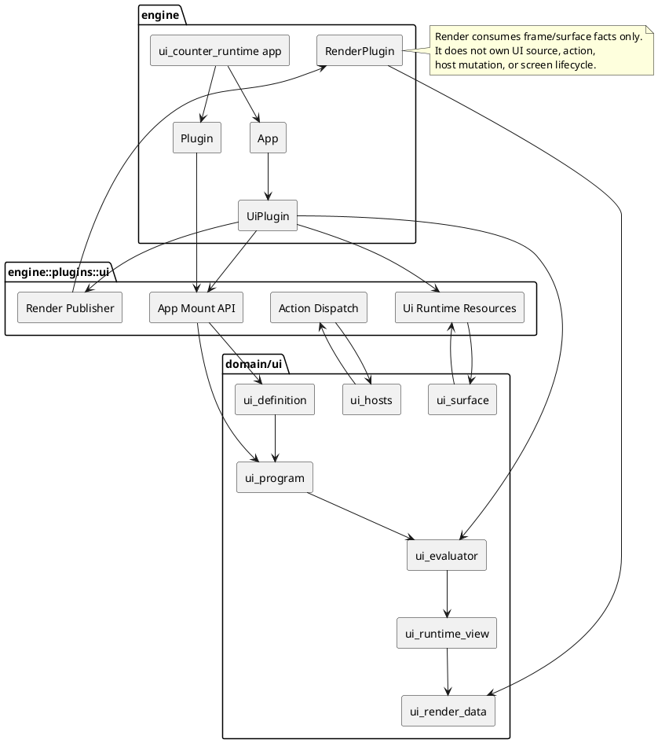
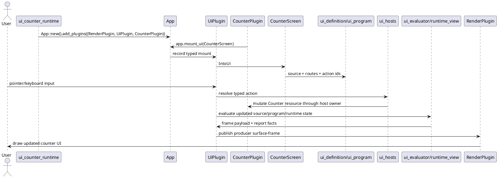
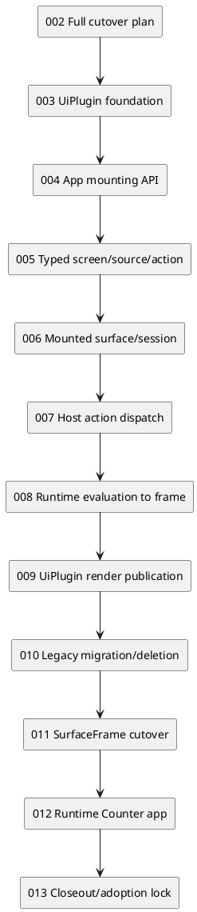

# Live UiPlugin Runtime Full Platform Cutover Plan

ID: `PT-UI-RUNTIME-PLATFORM-002`

Lifecycle state: `active-planning` full-platform cutover contract draft.

Implementation status: not started and not authorized by this planning PR.

## Purpose

This document turns the accepted `PT-UI-RUNTIME-PLATFORM-001` direction into a full implementation program. The next step is not a narrow `UiPlugin` skeleton plan. The next step is a complete cutover contract that is then executed through bounded implementation PRs.

Required position:

```text
Plan the whole Live UiPlugin Runtime Platform cutover now.
Implement it later through gated phase PRs.
Do not start runtime Rust work from this docs-only planning PR.
```

## Critical review result for this PR

The first draft of this plan was directionally correct but not handoff-complete. This hardened version makes the following corrections:

```text
1. Replace legacy/compatibility-producer language with a complete legacy migration and deletion requirement.
2. Require a runnable runtime Counter app product, not only an abstract proof.
3. Add an engine/render feature matrix so missing platform features are visible before implementation.
4. Add PlantUML architecture and sequence diagrams for implementation handoff.
5. State the implementation-documentation authorities checked by this plan.
6. Make each phase decision-complete enough for a simple implementation agent to follow without inventing architecture.
```

## Implementation-documentation authorities checked

This plan is bound by the workspace workflow and architecture docs below. If a future implementation phase contradicts one of them, stop and update the planning record before writing more code.

| Authority | How this plan uses it |
|---|---|
| `workspace/workflow-lifecycle.md` | Keeps this PR in planning, not implementation. |
| `workspace/complete-investigation-gate.md` | Inherits the PR #74 investigation and adds render/app-engine feature matrices for handoff. |
| `workspace/complete-design-gate.md` | Requires owner, dependency, validation, stop-condition, and acceptance criteria before implementation. |
| `workspace/complete-merge-readiness-gate.md` | Defines the report shape every implementation PR must satisfy. |
| `workspace/evidence-quality-taxonomy.md` | Separates connector/source/planning evidence from local command validation. |
| `guidelines/programming-principles.md` | Enforces KISS/DRY/YAGNI/SOLID/separation constraints in every phase. |
| `architecture/ui-framework-architecture.md` | Keeps source/program/runtime/render ownership separated. |
| `design/active/live-uiplugin-runtime-and-surface-frame-rendering-design.md` | Supplies the accepted target API and runtime/render boundary. |
| `reports/investigations/live-uiplugin-runtime-current-state-investigation.md` | Supplies current-state source facts and gaps. |
| `reports/closeouts/pt-ui-framework-app-integration-002-closeout.md` | Keeps `ui_app_integration` proof-local, not the final framework owner. |

Local command validation was not run in this connector-only planning session. The implementation plan therefore must not claim local validation until an agent runs it.

## Accepted basis

Authority comes from `PT-UI-RUNTIME-PLATFORM-001`:

```text
engine-owned UiPlugin runtime layer
reuse existing domain/ui contracts
app.mount_ui(Screen) as the normal app-authoring path
typed UiScreen / IntoUi / UiActionHandler / TryUiActionHandler
host-owned mutation through ui_hosts-compatible boundaries
mounted surface/session state through ui_surface-compatible boundaries
runtime/evaluator-backed output
UiPlugin-published frame submission
RenderPlugin consumes producer frame data without owning UI semantics
surface-frame genericization after the live runtime path is proven
```

This plan decomposes that accepted direction into implementation phases, evidence gates, validation, and stop conditions.

## No legacy runtime policy

Final merged runtime-platform code must not contain old legacy UI runtime paths, permanent adapters, or compatibility modules.

Allowed during implementation:

```text
short-lived migration code inside a branch before merge
comparison tests that prove old behavior was replaced
explicit deletion of old hardcoded render-owned UI producer paths
```

Not allowed in merged phase results:

```text
engine/src/plugins/ui/compat_*.rs
public legacy APIs for old manual add_ui_* registration chains
parallel old and new UI runtime paths
RenderPlugin-owned UI semantic producer collection
permanent aliases without a deletion phase
```

If replacing an old path requires temporary scaffolding, that scaffolding must be removed before the phase merges or the PR must stay draft.

## Global invariants

| Invariant | Rule |
|---|---|
| Engine owns app/plugin composition | `engine::plugins::ui` may integrate with `App` and `Plugin`; domain UI crates must not depend on engine. |
| Domain UI owns UI semantics | Source, program, surface, host, evaluator, runtime-view, and frame contracts stay in existing domain crates unless a later phase proves a small ownership adjustment. |
| App/host owns mutation | Generic UI controls, renderer code, and domain UI contracts must not mutate app state directly. |
| Render consumes output | RenderPlugin may consume producer/surface/frame facts; it must not own `UiScreen`, `IntoUi`, action routing, host mutation, or source/program semantics. |
| Public API stays ergonomic | Normal app authors use `app.mount_ui(Screen)` and typed handlers, not route maps, event packets, host adapters, or render registries. |
| Legacy paths are removed | Old scene/debug/render-owned UI collection must be migrated into the new producer model or deleted. |
| Genericization is real | `SurfaceFrame` vocabulary is completed only when UI-specific render ownership is removed and producer-generic naming is validated. |
| Counter app is runnable | The cutover is not complete until `cargo run -p ui_counter_runtime` starts an interactive app. |

## Architecture diagram



## Runtime sequence diagram



## Engine/render feature matrix

This matrix maps what the implementation program must prove. Unknowns must be investigated in the owning phase before code is merged.

| Area | Required platform feature | Current known source/authority | Missing / implementation work |
|---|---|---|---|
| App composition | Install `RenderPlugin`, `UiPlugin`, app plugin | Engine `App` / `Plugin` model exists | Add `engine::plugins::ui` and prelude/export decisions. |
| Public mounting | `app.mount_ui(Screen)` and `app.ui().mount(Screen)` | Accepted target API in PR #74 design | Implement extension, diagnostics, mount request storage. |
| Typed source | `UiScreen` / `IntoUi` lower to source/program facts | `ui_definition`, `ui_program`, `ui_program_lowering` authority | Implement engine-facing facade without duplicating domain semantics. |
| Typed actions | `UiActionHandler` / `TryUiActionHandler` mutate host-owned state | `ui_hosts`, `ui_app_integration` proof evidence | Implement typed dispatch, failure taxonomy, no-mutation negatives. |
| Mounted sessions | Surface/session identity, host identity, generation, retention | `ui_surface` authority | Wrap in engine resources without inventing another surface model. |
| Input to action | Pointer/keyboard events reach mounted UI and dispatch actions | Existing input/runtime docs and proof crates require inspection during Phase 007 | Implement only required path for Counter first; do not bypass route/capability checks. |
| Runtime output | Source/program/evaluator facts produce runtime-view output | `ui_evaluator`, `ui_runtime_view` | Wire mounted screen evaluation and report output facts. |
| Frame data | Runtime output becomes renderable frame payload | `ui_render_data::UiFrame` current payload | Publish through UiPlugin first; rename later only after producer path works. |
| Render publication | Render consumes producer/surface frame facts | Existing render submission resources | Move UI semantics out of RenderPlugin; RenderPlugin must not query screens/actions/host state. |
| Legacy render UI producers | Hardcoded scene/debug overlay collection | Current render runtime investigation from PR #74 | Replace/delete legacy hardcoded producer path; no permanent compatibility module. |
| Runnable product | User can start and interact with Counter app | Target product not present yet | Add `apps/ui_counter_runtime` with launch command and human-visible interaction. |
| Product proof | Automated evidence proves app path | `ui_app_integration` proof-local tests | Add live runtime proof through public API, not proof-local bridge. |
| Docs/diagrams | Architecture and sequence diagrams exist | PR #73 architecture spine pattern | Keep PlantUML diagrams and update docs truth on closeout. |

## Product target: runtime Counter app

The runtime platform is incomplete until it ships a runnable demo product, not only tests.

Required product crate:

```text
apps/ui_counter_runtime/Cargo.toml
apps/ui_counter_runtime/src/main.rs
root Cargo.toml workspace member entry
```

Required launch command:

```text
cargo run -p ui_counter_runtime
```

Required runtime behavior:

```text
opens a native app/window through the engine runtime path
installs RenderPlugin, UiPlugin, and CounterPlugin
CounterPlugin initializes Counter resource
CounterPlugin calls app.mount_ui(CounterScreen)
CounterScreen displays current count
user can increment the count through UI interaction
user can decrement the count through UI interaction
user can reset the count through UI interaction
keyboard shortcuts are supported if the engine input path already supports them cleanly; otherwise pointer interaction is the minimum required path
rendered text updates after each action
app exits cleanly
```

Required proof behavior:

```text
headless or integration test proves source/program/runtime/action/mutation/render facts
manual run instructions are documented in the PR
failure modes are fail-closed and report diagnostics
proof does not use ui_app_integration as the public runtime owner
```

## Phase map

| Phase | ID | Title | Main result |
|---|---|---|---|
| 002 | `PT-UI-RUNTIME-PLATFORM-002` | Full Platform Cutover Plan | This docs-only implementation-planning contract. |
| 003 | `PT-UI-RUNTIME-PLATFORM-003` | UiPlugin Foundation | Engine UI plugin module, resources, schedule/report shell. |
| 004 | `PT-UI-RUNTIME-PLATFORM-004` | App Mounting API | `app.mount_ui(Screen)` and `app.ui().mount(Screen)` record typed mount requests. |
| 005 | `PT-UI-RUNTIME-PLATFORM-005` | Typed Screen / Source / Action Contracts | `UiScreen`, `IntoUi`, `UiActionHandler`, and `TryUiActionHandler` lower into existing domain contracts. |
| 006 | `PT-UI-RUNTIME-PLATFORM-006` | Mounted Surface Session Runtime | Live mount/session registry using `ui_surface` contracts. |
| 007 | `PT-UI-RUNTIME-PLATFORM-007` | Host Action Dispatch | Typed event/action queue, host-owned mutation, fail-closed diagnostics. |
| 008 | `PT-UI-RUNTIME-PLATFORM-008` | Runtime Evaluation to Frame | Mounted screens produce evaluator/runtime-view-backed frame output. |
| 009 | `PT-UI-RUNTIME-PLATFORM-009` | UiPlugin Render Publication | UiPlugin publishes frame submissions; RenderPlugin consumes without owning UI semantics. |
| 010 | `PT-UI-RUNTIME-PLATFORM-010` | Legacy Scene/Debug Overlay Migration and Deletion | Old hardcoded render-owned UI producer paths are replaced or deleted; no permanent compatibility path remains. |
| 011 | `PT-UI-RUNTIME-PLATFORM-011` | SurfaceFrame Genericization Cutover | Producer-generic surface-frame vocabulary replaces UI-specific render ownership where scoped. |
| 012 | `PT-UI-RUNTIME-PLATFORM-012` | Runtime Counter App Product | Runnable `ui_counter_runtime` app plus public-path proof. |
| 013 | `PT-UI-RUNTIME-PLATFORM-013` | Closeout and Adoption Lock | Validation truth, merge readiness, remaining gaps, and next-track activation rules. |

## Per-phase contracts

### Phase 003 — UiPlugin Foundation

Allowed scope:

```text
engine/src/plugins/ui/mod.rs
engine/src/plugins/ui/plugin.rs
engine/src/plugins/ui/schedule.rs
engine/src/plugins/ui/resources.rs
engine/src/plugins/ui/report.rs
engine/src/plugins/ui/diagnostics.rs
engine/src/plugins/mod.rs
engine/Cargo.toml only if justified
focused engine tests for plugin installation/resource initialization
```

Required evidence:

```text
UiPlugin installs without panicking
plugin install is idempotent or reports duplicate install deterministically
resources have stable default state
schedule labels exist without render/backend ownership changes
```

Stop if this requires `foundation/meta`, `domain/app_program`, a generic plugin framework, domain UI depending on engine, or a render backend rewrite.

### Phase 004 — App Mounting API

Allowed scope:

```text
engine/src/plugins/ui/app_ext.rs
engine/src/plugins/ui/mount.rs
engine/src/plugins/ui/resources.rs
engine/src/plugins/ui/diagnostics.rs
engine/src/prelude.rs if accepted for public export
focused engine tests/examples proving app.mount_ui and app.ui().mount compile
```

Required evidence:

```text
normal path records a mount request without manual surface factory setup
advanced path records the same mount request with explicit configuration/reporting hooks
mount diagnostics include screen identity, mount source, and stable failure reason
normal users are not exposed to route maps, event packets, host adapters, or render registries
```

Stop if the common path needs manual host adapters, manual route maps, manual render submission writes, or private App internals that are not part of the accepted engine API.

### Phase 005 — Typed Screen / Source / Action Contracts

Allowed scope:

```text
engine/src/plugins/ui/screen.rs
engine/src/plugins/ui/source.rs
engine/src/plugins/ui/action.rs
engine/src/plugins/ui/host.rs
engine/src/plugins/ui/diagnostics.rs
engine/Cargo.toml dependency additions for selected domain/ui crates
focused engine tests plus comparison evidence from ui_app_integration where useful
```

Required evidence:

```text
typed screen lowers to ui_definition-compatible source records
typed source produces route/source-map facts
typed action handler emits host-owned mutation intent
action identity is stable and diagnostic-friendly
ui_app_integration remains proof evidence, not final framework owner
```

Stop if typed UI skips source/program facts, if generic controls mutate app state directly, or if a new broad runtime-platform domain crate becomes necessary.

### Phase 006 — Mounted Surface Session Runtime

Allowed scope:

```text
engine/src/plugins/ui/resources.rs
engine/src/plugins/ui/mount.rs
engine/src/plugins/ui/report.rs
engine/Cargo.toml dependency on ui_surface if not already present
focused engine tests for mount/unmount/generation/session reports
```

Required evidence:

```text
mount creates a MountedSurfaceInstance-compatible record
session identity, host identity, generation, retention, and diagnostics are recorded
unmount/remount behavior is deterministic
multiple mounted screens/surfaces do not collide
no duplicate surface/session semantic model is invented inside engine
```

Stop if this requires world-space UI, SDF, SpatialCanvas, product/editor/game semantics in domain UI, or replacing `ui_surface` instead of adapting to it.

### Phase 007 — Host Action Dispatch

Allowed scope:

```text
engine/src/plugins/ui/events.rs
engine/src/plugins/ui/action.rs
engine/src/plugins/ui/host.rs
engine/src/plugins/ui/report.rs
engine/src/plugins/ui/diagnostics.rs
engine/Cargo.toml dependency on ui_hosts if not already present
focused positive and negative engine tests
```

Required evidence:

```text
known action mutates only through app/host owner
unknown route does not mutate
schema mismatch does not mutate
capability mismatch does not mutate
payload mismatch does not mutate
missing host data does not mutate
action report records route/action/host/failure reason
```

Stop if errors become silent, partial mutation is possible on invalid input, or product/editor/game semantics move into generic UI.

### Phase 008 — Runtime Evaluation to Frame

Allowed scope:

```text
engine/src/plugins/ui/source.rs
engine/src/plugins/ui/resources.rs
engine/src/plugins/ui/report.rs
engine/src/plugins/ui/diagnostics.rs
engine/Cargo.toml dependencies on selected evaluator/runtime-view/render-data crates
focused engine tests for output facts and frame payload creation
```

Required evidence:

```text
mounted screen source/program facts feed evaluator/runtime-view path
Counter output text changes after host mutation
frame payload is derived from runtime/evaluator output
runtime report includes source, program, runtime-view, output, and diagnostics facts
visible output is not reported as success without upstream facts
```

Stop if frame output skips source/program/evaluator evidence, if a new execution strategy is invented without accepted design, or if renderer primitives become UI source truth.

### Phase 009 — UiPlugin Render Publication

Allowed scope:

```text
engine/src/plugins/ui/render_publish.rs
engine/src/plugins/ui/report.rs
existing render submission registry/resource paths only where needed
focused engine/render integration tests
```

Required evidence:

```text
UiPlugin publishes frame submission with producer id and surface identity
RenderPlugin consumes prepared payload without querying UiScreen, IntoUi, actions, host mutation, or route policy
render contribution is deterministic for the same runtime frame
missing UiPlugin frame reports a diagnostic instead of silent success
```

Stop if RenderPlugin becomes the UI runtime owner, pulls from app host state directly, or needs a broad backend rewrite.

### Phase 010 — Legacy Scene/Debug Overlay Migration and Deletion

Allowed scope:

```text
specific existing render collection paths identified by the phase investigation
engine/src/plugins/ui/** only if the new UiPlugin producer path needs migration helpers that are removed before merge
focused tests proving existing scene/debug overlay behavior through the new producer path or proving intentional deletion
```

Required evidence:

```text
every old hardcoded scene/debug UI producer path is named
replacement path is named or deletion is justified
no compat_*.rs modules remain after merge
no old manual UI registration path remains public
RenderPlugin no longer owns UI semantic producer collection
```

Stop if the PR leaves parallel old/new runtime paths, changes unrelated render behavior, or creates a second UI runtime.

### Phase 011 — SurfaceFrame Genericization Cutover

Allowed scope:

```text
only the render frame/submission contracts named by the phase PR
only ui_render_data names/types touched by the accepted migration map
focused migration tests and compile checks
```

Required evidence:

```text
migration map lists every renamed type/module/function
producer-generic names replace UI-specific render ownership at the accepted seam
UiPlugin remains one producer, not the generic surface-frame owner
scene/debug migrated/deleted paths still work or are intentionally gone
external docs no longer imply RenderPlugin owns UI semantics
```

Stop if the rename becomes broad/unreviewable or source/program/action semantics must change.

### Phase 012 — Runtime Counter App Product

Allowed scope:

```text
apps/ui_counter_runtime/**
root Cargo.toml workspace member entry
focused engine tests/examples for Counter app
engine/src/plugins/ui/** fixes only if required by product proof and scoped
planning docs and proof report fixtures
```

Required evidence:

```text
cargo run -p ui_counter_runtime starts the app
app installs RenderPlugin, UiPlugin, and CounterPlugin
CounterPlugin uses app.mount_ui(CounterScreen)
CounterScreen implements the accepted typed screen/source/action model
UI exposes increment, decrement, and reset actions
user interaction mutates Counter only through host-owned path
runtime/evaluator output changes after mutation
UiPlugin publishes render submission
RenderPlugin consumes the submission without UI semantic ownership
positive proof and fail-closed negative proof are both present
manual run instructions and observed behavior are recorded in the PR
```

Stop if the proof cannot show source/program/runtime/action/mutation/render facts, if it needs proof-local `ui_app_integration` as the public runtime owner, or if the product cannot be launched by command.

### Phase 013 — Closeout and Adoption Lock

Allowed scope:

```text
docs-site/src/content/docs/reports/closeouts/**
docs-site/src/content/docs/workspace/planning/active-work.md
docs-site/src/content/docs/workspace/planning/roadmap.md
docs-site/src/content/docs/workspace/planning/production-tracks.md
docs-site/src/content/docs/workspace/planning/decision-register.md
owning design docs only for final truth and known gaps
```

Required evidence:

```text
all implementation phase PRs and merge commits are recorded
final validation commands and results are recorded
remaining gaps are explicit
next-track activation is explicit
legacy paths are gone or explicitly documented as intentionally removed
```

Stop if final validation cannot be proven, planning truth disagrees with merged code, or next implementation starts before closeout truth is recorded.

## Cross-phase dependency graph



`010` must not preserve permanent legacy code. `011` must not start before `009` proves the live producer path and `010` has either removed or migrated the old render-owned producer path. `012` may accumulate evidence from earlier phases but must not be declared complete until launch, interaction, render publication, and fail-closed action dispatch are proven through the public app-facing path.

## Validation envelope

Every implementation phase must run the smallest focused crate/test set required by its scope plus docs and diff hygiene. The default final gate is:

```text
cargo test -p engine <focused phase tests>
phase-owned domain crate tests when touched or depended on
cargo test --workspace before broad runtime/render migration or final product proof
python tools/docs/validate_docs.py
git diff --check
git status --short --branch
git diff --stat main...HEAD
```

Phase 012 must additionally record the result of:

```text
cargo run -p ui_counter_runtime
```

Do not claim validation that was not run.

## Merge-readiness report shape

Every implementation PR must report:

```text
branch/head SHA
base SHA or refreshed-from-main status
exact files changed
exact modules/functions/sections changed
validation commands run and results
proof/evidence artifacts added
legacy/removal status where relevant
stop conditions checked
known blockers and deferrals
next phase recommendation
```

## Handoff contract for a simple implementation agent

A simple implementation agent must receive exactly one phase at a time. The prompt must include:

```text
phase ID and title
allowed files/crates
forbidden files/crates
expected public API shape
required tests/proofs
required docs updates
validation commands
stop conditions
instruction to stop rather than widen scope
```

The agent must not decide to add a generic plugin framework, revive `domain/app_program`, preserve old legacy UI runtime paths, or implement SDF/world-space/SpatialCanvas as part of this runtime-platform cutover.

## Current planning PR acceptance criteria

This planning PR is acceptable when it records:

```text
full phase map from planning through closeout
per-phase purpose, allowed files/crates, evidence, validation, and stop conditions
global invariants
render/app-engine feature matrix
runnable Counter product requirement
legacy deletion policy
PlantUML architecture and sequence diagrams
cross-phase dependency graph
explicit correction from first-slice-only planning to full-platform cutover planning
planning-file state transition to PT-UI-RUNTIME-PLATFORM-002
no runtime implementation
```

## Next action after this PR merges

Open `PT-UI-RUNTIME-PLATFORM-003 — UiPlugin Foundation` as the first implementation PR. That PR must stay inside Phase 003 boundaries and must not opportunistically implement the whole platform.
