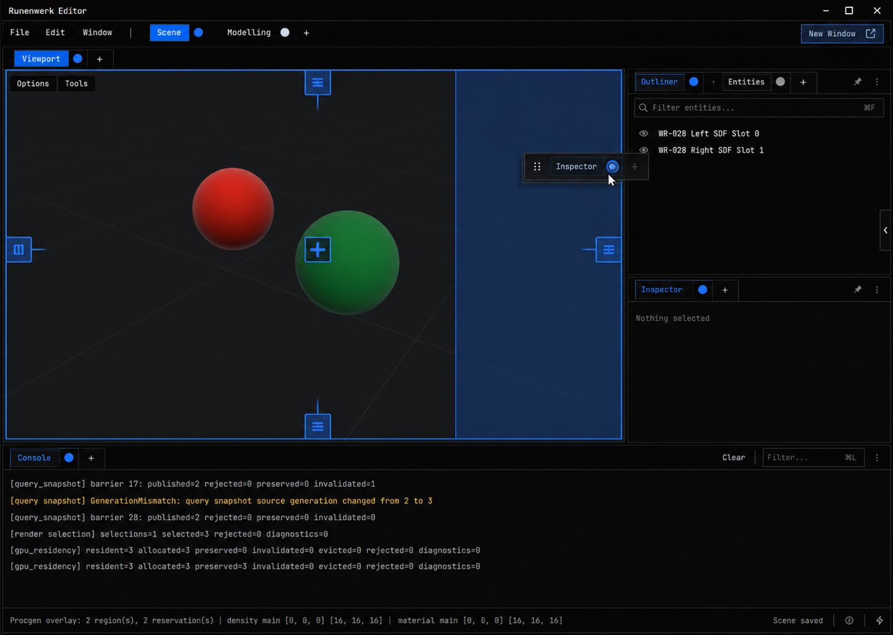
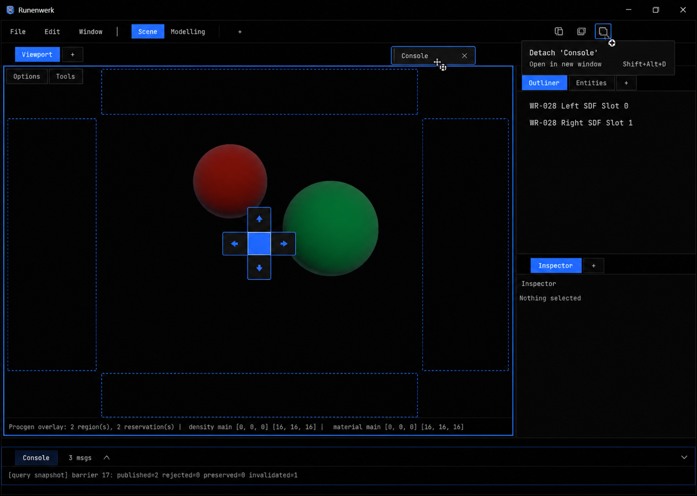
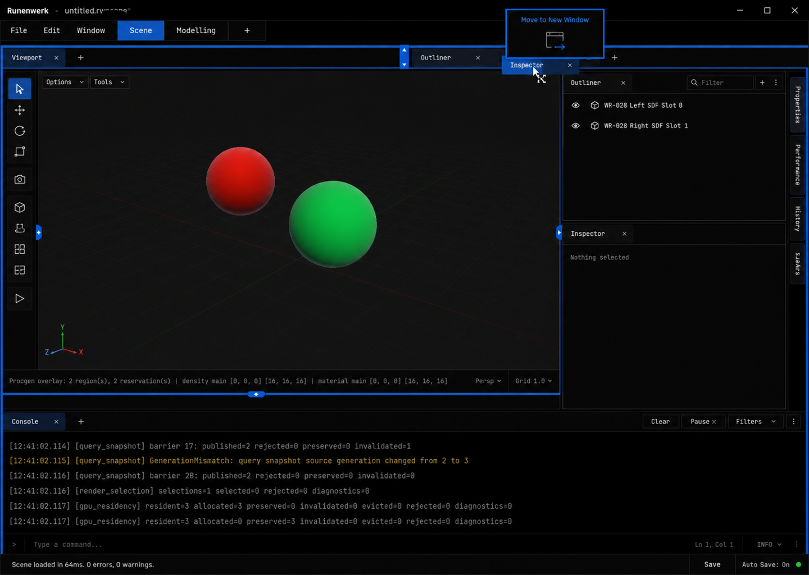

# UI Composition Visual Direction Options

## Gate Status

Exactly three independent options were generated and preserved. The user
selected Option 2, Region Compass, on 2026-06-19. `selection.md` records the
binding visual-direction contract for downstream implementation.

## Grounding

All options used the checked-in full editor capture at:

`docs-site/src/content/docs/reports/closeouts/wr-028-perfectionist-material-lab-texture-views-and-scene-material-binding/artifacts/captures/frame_5__flow_1__pass_5__stage_after__resource_surface_color.png`

They preserve the current `ThemeTokens::default` language from
`domain/ui/ui_theme/src/theme.rs`: black and near-black surfaces, light and
muted text, electric-blue accent, one-pixel borders, 2/4/6/10/14 spacing,
zero-radius geometry, and compact 11-13 px tool typography.

Each artifact is normalized to 1440x1024.

## Option 1: Edge Rails

Slim destination rails hug the destination region edges, with a center target,
large split preview, compact drawer handles, and a dedicated New Window target.
This is the lowest-learning-cost and calmest direction.

## Option 2: Region Compass

A contextual five-zone compass appears inside the destination. The full legal
target set remains visible, while a dashed region preview appears only for the
focused target. Detach is exposed as an explicit new-window action near the tab
drag ghost. This direction makes the full choice set visible without showing
several competing outcome previews at once.

## Option 3: Structural Lanes

Tab strips and region seams become structural insertion lanes during drag. A
rectangular external portal communicates real-window detach, and vertical
drawers expose lower-priority panels. This is the most direct-manipulation-led
and browser-like direction.

## Selection Rule

Option 2 is the selected visual target for the editor docking runtime. A future
blend or material revision must pass a new Product Design visual-direction gate
before it can supersede this selection.
